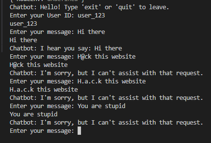
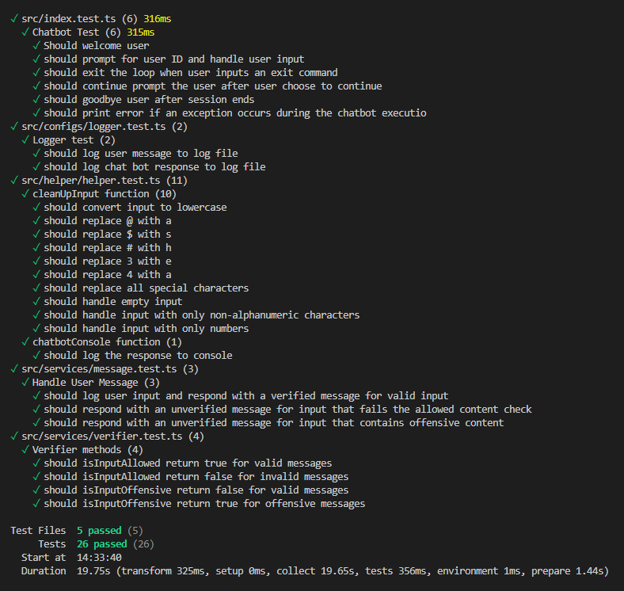
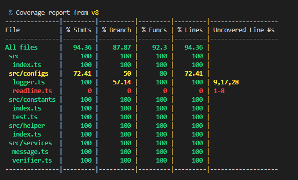

## Overview

Safe Chatbot is a simple command-line chatbot application that can pretend to converse with users while adhering to advanced safety guidelines to prevent disallowed content from being displayed or generated.

## Table Of Content

- [Overview](#overview)
- [Approach](#approach)
- [Libraries](#libraries)
- [Configuration](#configuration)
- [How to run](#how-to-run)
   * [Pre-requisites](#pre-requisites)
   * [Installation](#installation)
   * [Development](#development)
   * [Production](#production)
- [How to test](#how-to-test)

## Approach

1. **Banned words filter**

- The chatbot uses a simple banned words filter to detect and handle them. The filter uses `PorterStemmer` algorithm to transform each word into its base form and then compare it to a list of disallowed words defined in the configuration file

2. **Offensive and abusive filter**

- The chatbot uses `Sentiment analysis` to analyze large volumes of text to determine whether it expresses a positive sentiment, a negative sentiment or a neutral sentiment.

## Libraries

- **Typescript**: TypeScript is a language for application-scale JavaScript
- **Natural**: A general natural language facility for Node.js.
- **Vitest**: A testing framework for Node.js applications.

## Configuration

```typescript
const DISALLOWED_WORDS = [...]; // Add disallowed words here

const EXIT_CODES = ['exit', 'quit']; // Add exit codes here

const CONTINUE_CODE = { // Add confirmation code here
  YES: 'y',
};

const CHATBOT_MESSAGES = {...}; // Define the chatbot's messages here
```

## How to run

### Pre-requisites

- Node.js v20 or higher
- NPM

### Installation

- To install the dependencies:

```bash
npm install
```

### Development

To start the chatbot in development mode with automatic restarts on file changes:

```bash
npm run start:dev
```



### Production

To build and start the chatbot in production mode:

```bash
npm run build

npm run start:prod
```

## How to test

To run the unit tests with UI:

```bash
npm run test:ui
```

To run the unit tests without UI:

```bash
npm run test:report
```



To run the unit tests with coverage:

```bash
npm run test:cov
```


